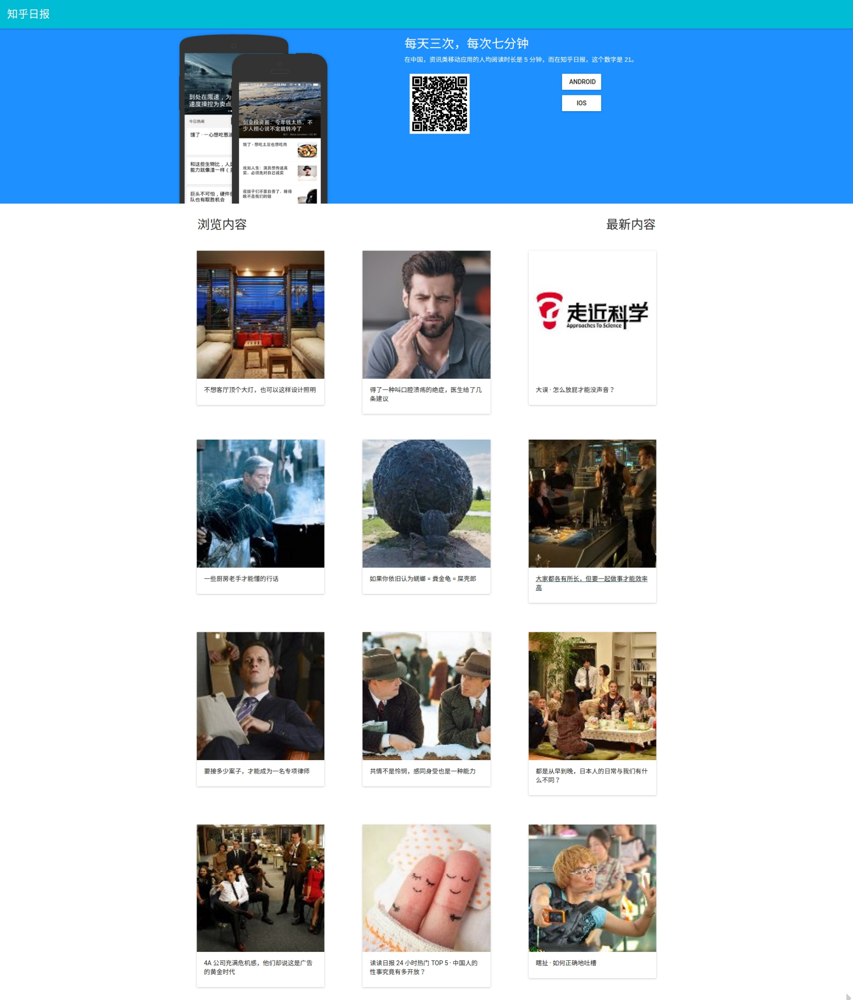

# 知乎日报

## 库
- React
- react-router
- react-tap-event-plugin
- material-ui

## 主页



## 详情


## 注
> 由于浏览器同源策略和知乎日报API限制，导致不能在域名下访问知乎日报API。故使用[ZhiHuProxy](https://github.com/Kutear/zhihuproxy)转发

```
http://news-at.zhihu.com/api/4/start-image/1080*1776  => http://host:8080/?path=/api/4/start-image/1080*1776
```
返回数据没有改变
